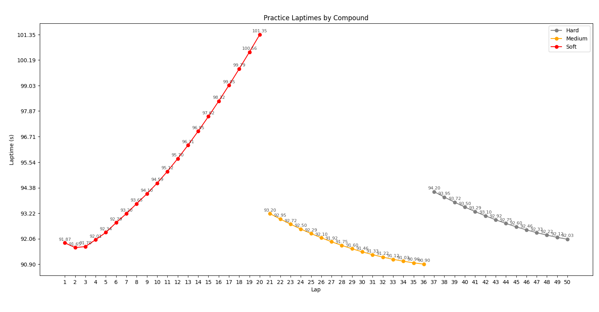
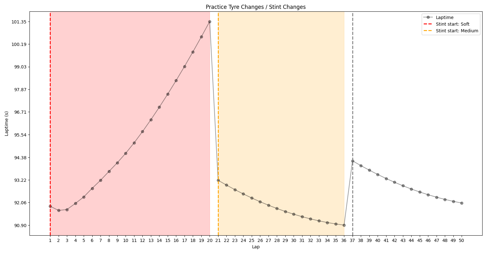

# 🏁 F1 Szabadedzés és Versenystratégia Elemző

Ez a Python program egy **F1-es szabadedzés** adatainak elemzésére, vizualizálására és versenystratégia ajánlására szolgál.

---

## ✨ Fő funkciók

1. **Adatbetöltés**
   - A program a `data.csv` fájlból tölti be az adatokat.
   - A CSV-nek tartalmaznia kell legalább a következő oszlopokat:
     - `Lap`, `Laptime`, `Compound (C1-6)`, `Front/Rear left/right tire usage (percentage)`, stb.

2. **Adatmegadás**
   - A felhasználó megadja az alapvető adatokat amelyek szükségesek a számoláshoz, ha hibásan adja meg akkor az alapértelmezett értékeket használja.
   (wear_threshold, race_length_laps, required_pitstops, min_compound_changes) 

2. **Elemzés és statisztikák**
   - Leggyorsabb kör, átlagos köridő, kopás, degradáció minden keverékre.
   - **Kerékcsere (stintváltás) detektálás:** ha a kopás visszaesik vagy keverék vált, új stint kezdődik.

3. **Versenystratégia ajánló**
   - A kopás (degradáció) alapján számolja ki, hogy egy keverék hány kört bír.
   - A kívánt futamhosszra, pitstop-számra és kötelező keverékváltásra ajánl stinteket.
   - Nem engedi, hogy egymás után ugyanazt a keveréket használja, ha nem muszáj.

4. **Interaktív, lapozható vizualizáció**
   - A program **három oldalas grafikus felületet** ad:
     1. **Szabadedzés köridők:** minden kör, minden compound színnel, laptime kiírva.
     2. **Kerékcserék/stintváltások:** színes sávok, függőleges vonalak a cseréknél, háttérben a köridő-görbe.
     3. **Versenystratégia:** stintek, pitstopok, compound színezéssel.

5. **Vizualizáció**
    1. **Szabadedzés köridők**: Compound színezéssel, minden kör külön pontként, laptime kiírva
    2. **Kerékcserék/stintváltások:** Színes sávok, függőleges vonalak, háttérben a köridő-görbe.
    3. **Versenystratégia:** Stintek, pitstopok, compound színezéssel.
---

## ⌨️ Használat

### Követelmények

- **Python 3**
- `pandas`, `matplotlib`, `numpy` csomagok  

### Adatfájl

- Helyezd el a `data.csv` fájlt a program mellé.

### Futtatás

- python main.py

### Lapozás

- Jobbra nyíl / PageDown: következő oldal
- Balra nyíl / PageUp: előző oldal

---

## Példák a vizualizációkra

